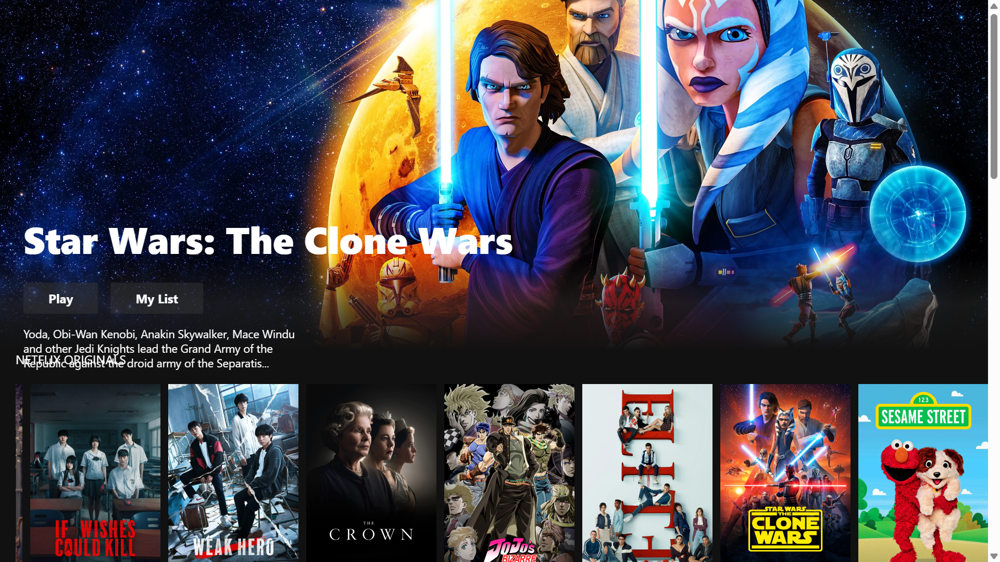
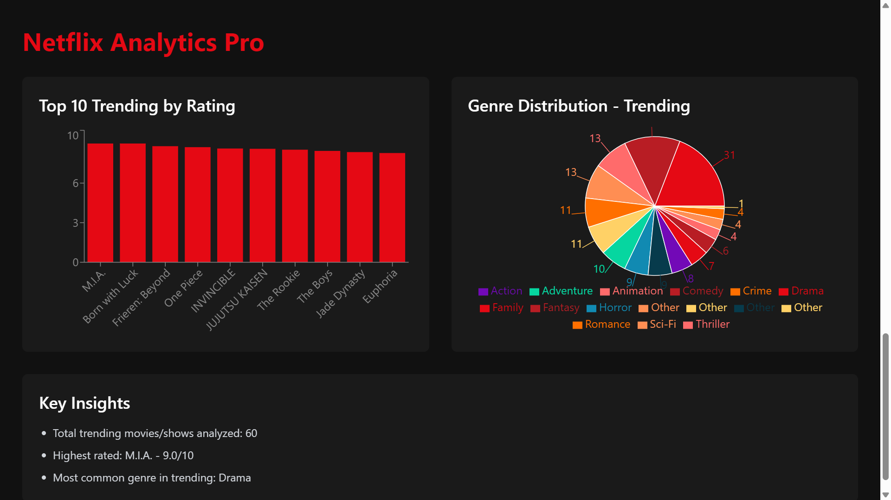

# 🎬 Netflix Clone + Analytics Pro

A full-stack Netflix homepage clone built with React.js and TMDB API, featuring real-time movie data, YouTube trailer integration, and a custom analytics dashboard for content insights.

## 📸 Project Showcase

### **1. Netflix Clone UI**

*Fully responsive Netflix homepage with dynamic banner, category rows, and embedded YouTube trailer player*

### **2. Analytics Dashboard** 

*Data visualization dashboard showing Top 10 Trending by Rating and Genre Distribution analysis*

## 🚀 Live Demo
[Netflix Clone Live](https://streamlix-akash.netlify.app)

## ✨ Core Features

### **Netflix Clone**
- **Dynamic Banner** - Fetches random Netflix Original on every refresh from TMDB API
- **YouTube Trailer Integration** - Play button fetches official trailers via TMDB `/videos` endpoint
- **Movie Categories** - Netflix Originals, Trending Now, Top Rated, Action, Comedy, Horror
- **Crash-Free Playback** - Error handling for missing trailers + initial load protection
- **Netflix-Style UI** - Hover effects, fade animations, responsive grid layout
- **Real-Time Data** - Live movie posters, ratings, and descriptions from TMDB

### **Analytics Pro Dashboard**
- **Top 10 Trending by Rating** - Bar chart of highest rated movies/shows
- **Genre Distribution** - Pie chart breakdown: Drama, Action, Animation, Sci-Fi, etc.
- **Key Insights Engine** - Auto-calculates: Total analyzed, Highest rated, Most common genre

## 🛠️ Tech Stack

| Technology | Purpose |
| --- | --- |
| **React.js** | Frontend framework with Hooks |
| **Axios** | HTTP client for TMDB API calls |
| **TMDB API** | Movie database + YouTube trailer keys |
| **react-youtube** | Embedded video player |
| **CSS3** | Custom styling + Netflix animations |
| **Recharts/Chart.js** | Data visualization for analytics |

## 📦 Quick Start

1. **Clone repository**
```bash
git clone https://github.com/akas1234-design/netflix-clone-react.git
cd netflix-clone-react
